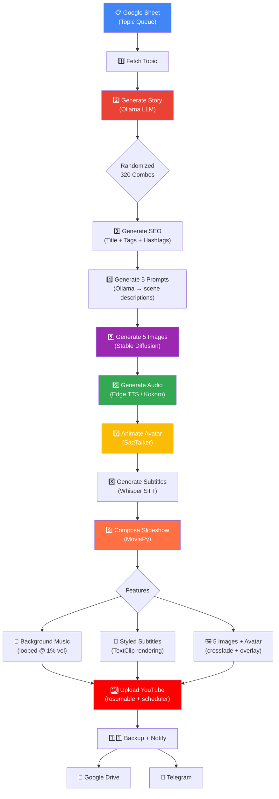
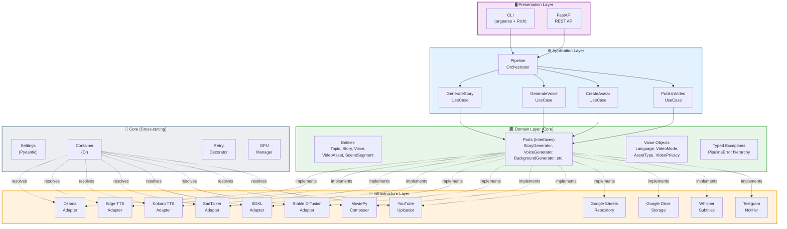
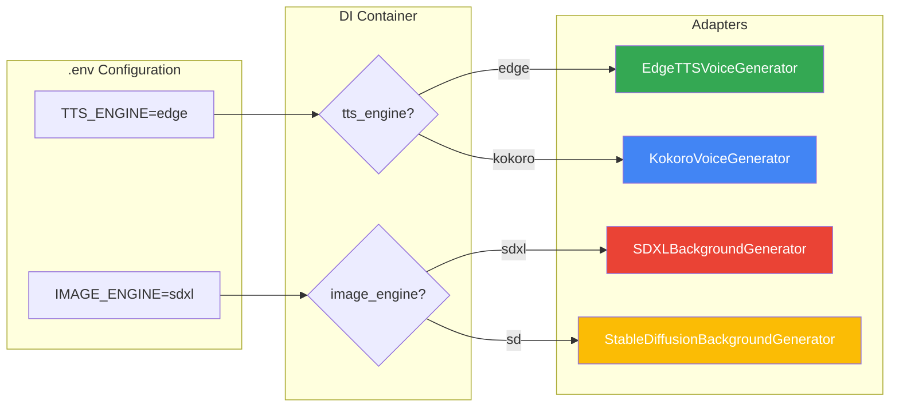
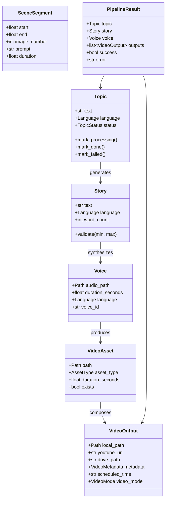
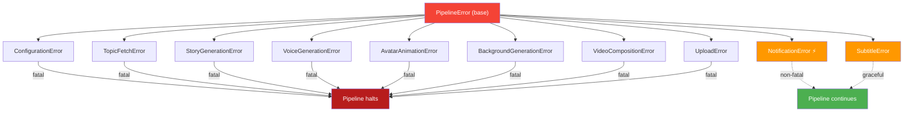

<div align="center">

# 🤖 AI YouTube Shorts — Automated Video Pipeline

**Production-grade AI pipeline built with Clean Architecture that auto-generates and publishes motivational YouTube Shorts.**

_Story Generation → Voice Synthesis → Talking Avatar → Video Composition → Auto Upload_

[](https://github.com/tamilarasu/ai-youtube-automation/actions)
[](https://www.python.org)
[](docs/architecture.md)
[](LICENSE)
[](https://github.com/astral-sh/ruff)
[](pyproject.toml)

</div>

---

## 🎬 Pipeline Flowchart



---

## 🧠 System Architecture



---

## 🔌 Config-Driven Adapter Selection

Swap adapters at runtime via `.env` — zero code changes:



---

## 📊 Domain Model



---

## 🚨 Error Handling Strategy



---

## ⚡ Tech Stack

| Layer         | Technology                  | Purpose                                        |
| ------------- | --------------------------- | ---------------------------------------------- |
| **LLM**       | Ollama (Gemma 3 12B)        | Story generation, SEO metadata, image prompts  |
| **TTS**       | Edge TTS / Kokoro           | Voice synthesis (cloud or local, configurable) |
| **Avatar**    | SadTalker + GFPGAN          | Talking-head video generation                  |
| **STT**       | OpenAI Whisper              | Subtitle generation from audio                 |
| **Image Gen** | SDXL / Stable Diffusion 2.1 | 5 scene images per video (local GPU)           |
| **Video**     | MoviePy + FFmpeg            | Slideshow + avatar overlay + bgm + subtitles   |
| **Queue**     | Google Sheets API           | Topic management                               |
| **Upload**    | YouTube Data API v3         | Resumable upload with scheduling               |
| **Notify**    | Telegram Bot API            | Pipeline notifications                         |
| **Storage**   | Google Drive API            | Video backup                                   |
| **Config**    | Pydantic Settings           | Type-safe .env loading                         |
| **API**       | FastAPI + Uvicorn           | REST API for remote triggering                 |
| **DI**        | Custom Container            | Config-driven adapter selection                |
| **CI/CD**     | GitHub Actions              | Lint (Ruff) + Tests (Pytest)                   |

> **Total cost: $0** — All components are free-tier or open-source. No external API keys required.

---

## 🏗️ Clean Architecture Principles

| Principle                  | Implementation                                  |
| -------------------------- | ----------------------------------------------- |
| **Dependency Inversion**   | Domain ports (ABC) → Infrastructure adapters    |
| **Single Responsibility**  | One use case per operation                      |
| **Open/Closed**            | New adapters without modifying business logic   |
| **Interface Segregation**  | 13 focused port interfaces                      |
| **Separation of Concerns** | 5 distinct layers with clear boundaries         |
| **Dependency Injection**   | Container wires ports → adapters at startup     |
| **Fail-Safe Design**       | Typed exceptions, retry with backoff, fallbacks |
| **GPU Lifecycle**          | Context managers for VRAM management            |

---

## 📁 Project Structure

```
ai-youtube-automation-clean/
├── src/ai_shorts/
│   ├── domain/                    # 🏛️ Business core (zero dependencies)
│   │   ├── entities.py            # Topic, Story, Voice, VideoAsset, SceneSegment, VideoOutput
│   │   ├── value_objects.py       # Language, VideoMode, AssetType, VideoPrivacy
│   │   ├── ports.py               # 13 abstract interfaces (contracts)
│   │   └── exceptions.py          # 9 typed exceptions (one per pipeline stage)
│   │
│   ├── application/               # ⚙️ Use cases + orchestrator
│   │   ├── use_cases.py           # 7 use cases (GenerateStory, GenerateSceneImages, etc.)
│   │   └── pipeline.py            # PipelineOrchestrator (11-step sequencing)
│   │
│   ├── infrastructure/adapters/   # 🔧 External service implementations
│   │   ├── ollama.py              # LLM (story + metadata + 5 scene prompts)
│   │   ├── edge_tts.py            # Cloud TTS (Microsoft Edge)
│   │   ├── kokoro_tts.py          # Local TTS (CPU-friendly)
│   │   ├── sadtalker.py           # Avatar animation (talking head)
│   │   ├── whisper.py             # Speech-to-text subtitles
│   │   ├── sdxl.py                # SDXL image gen (local GPU)
│   │   ├── flux_image.py          # SD 2.1 + SceneImageGenerator (local GPU)
│   │   ├── moviepy_composer.py    # Slideshow + avatar overlay + bgm + subtitles
│   │   ├── youtube.py             # YouTube upload + scheduling
│   │   ├── google_sheets.py       # Topic queue (Google Sheets)
│   │   ├── google_drive.py        # Cloud backup
│   │   └── telegram.py            # Notifications
│   │
│   ├── presentation/              # 🖥️ User interfaces
│   │   └── api.py                 # FastAPI REST API (/generate, /batch, /health)
│   │
│   ├── core/                      # 🧱 Cross-cutting concerns
│   │   ├── config.py              # Pydantic Settings (type-safe .env)
│   │   ├── container.py           # DI Container (config-driven adapter wiring)
│   │   ├── resilience.py          # retry_with_backoff decorator
│   │   ├── gpu.py                 # GPU memory management
│   │   ├── timer.py               # Pipeline timing instrumentation
│   │   └── logging.py             # Structured logging setup
│   │
│   └── cli.py                     # CLI (run, setup, serve, batch)
│
├── assets/images/avatar.png       # Default avatar image
├── tests/                         # 31 unit tests
├── docs/                          # Architecture docs + setup guide
├── .github/workflows/ci.yml       # GitHub Actions CI
└── pyproject.toml                 # V2.0 — modern Python packaging
```

---

## 🚀 Quick Start

### 1. Clone & Install

```bash
git clone https://github.com/tamilarasu/ai-youtube-automation.git
cd ai-youtube-automation

# Create virtual environment
python -m venv .venv
source .venv/bin/activate  # Linux/Mac
# .venv\Scripts\activate   # Windows

# Install
pip install -e ".[dev]"
```

### 2. Configure

```bash
cp .env.example .env
# Edit .env with your API keys (see docs/SETUP.md)
```

### 3. Validate

```bash
ai-shorts setup
```

### 4. Run

```bash
ai-shorts run                              # Full pipeline
ai-shorts run --mode test                   # Test mode (story → voice → avatar only)
ai-shorts run --video-mode slideshow        # Slideshow mode (image-based, no avatar)
ai-shorts run --schedule "2026-03-01T10:00:00+05:30"  # Scheduled publish
```

### 5. API Mode

```bash
ai-shorts serve --port 8000                 # Start FastAPI server
# POST http://localhost:8000/generate {"topic": "...", "language": "en"}
```

### 6. Batch Mode

```bash
ai-shorts batch --input topics.json         # Process topics from JSON file
```

---

## 🧪 Testing

```bash
pytest tests/ -v            # Run 31 unit tests
pytest tests/ --cov         # Tests + coverage report
ruff check src/             # Lint
ruff format --check src/    # Format check
```

---

## 🌐 Supported Languages

| Language | Code | Voice | Subtitles | Story |
| -------- | ---- | ----- | --------- | ----- |
| Tamil    | `ta` | ✅    | ✅        | ✅    |
| English  | `en` | ✅    | ✅        | ✅    |
| Hindi    | `hi` | ✅    | ✅        | ✅    |

---

## ✨ V2.0 Features

| #   | Feature                     | What it does                                                |
| --- | --------------------------- | ----------------------------------------------------------- |
| 1   | **Randomized story styles** | 8 styles × 5 tones × 8 characters = 320 unique combinations |
| 2   | **Background music**        | Auto-looped at 1% volume via CompositeAudioClip             |
| 3   | **Styled subtitles**        | MoviePy TextClip with stroke, word-wrapping                 |
| 4   | **Scheduled upload**        | YouTube `publishAt` with auto privacy management            |
| 5   | **Kokoro TTS**              | Local CPU-friendly TTS, 100-word chunking                   |
| 6   | **Stable Diffusion**        | Local GPU image gen (SD 2.1, no API keys needed)            |
| 7   | **Image prompt gen**        | LLM summarizes story → image prompt                         |
| 8   | **FastAPI REST API**        | Remote pipeline triggering via HTTP                         |
| 9   | **Batch processing**        | JSON file → sequential pipeline runs                        |
| 10  | **Scene segments**          | Per-segment image generation domain model                   |
| 11  | **Slideshow mode**          | Image-based video without avatar                            |
| 12  | **Resumable upload**        | Chunked YouTube upload with progress %                      |

---

## 🛡️ Resilience Features

- **Retry with Exponential Backoff** — All external API calls (3 attempts, 2-60s delay)
- **GPU Memory Management** — Automatic VRAM cleanup between pipeline stages
- **Whisper Model Fallback** — `large-v3` → `medium` → `base` on GPU OOM
- **SadTalker Fallback** — Ken Burns zoom effect if GPU inference fails
- **Graceful Degradation** — Subtitles, notifications, and Drive save are non-fatal
- **Typed Exceptions** — Each pipeline stage has its own error type (9 total)
- **Config-Driven Swapping** — Switch adapters via `.env` without code changes

---

## 📜 License

MIT License — see [LICENSE](LICENSE) for details.

---

<div align="center">

**Built with Clean Architecture principles** ❤️

_Demonstrating production-grade Python engineering: SOLID, DDD, Hexagonal Architecture, and System Design_

</div>
