<div align="center">

# 🤖 AI YouTube Shorts — Fully Automated Video Pipeline

**A production-grade, zero-cost AI system that auto-generates and publishes motivational YouTube Shorts — from topic to upload — using Clean Architecture and 7 AI models running on a single T4 GPU.**

_Google Sheet Topic → LLM Story → Neural Voice → Lip-Synced Avatar → AI Scene Images → Auto Upload to YouTube_

[](https://www.python.org)
[](docs/architecture.md)
[](tests/)
[](LICENSE)
[](https://github.com/astral-sh/ruff)

</div>

---

## 🎯 What This Project Does

Automates the **entire YouTube Shorts creation pipeline** — no human intervention required:

1. **Picks a topic** from a Google Sheet queue
2. **Writes a unique story** using LLM (320 style combinations)
3. **Generates 5 anime-style scene images** matching the story (SDXL Turbo)
4. **Synthesizes natural speech** (Edge TTS / Kokoro)
5. **Creates a lip-synced talking avatar** with head movement (SadTalker + GFPGAN)
6. **Generates word-level subtitles** (OpenAI Whisper)
7. **Composes a polished video** with slideshow transitions, circular avatar overlay, and background music
8. **Uploads to YouTube** with SEO title/tags/description and scheduling
9. **Backs up to Google Drive** and **notifies via Telegram**

> **Total cost: $0** — runs entirely on Google Colab Free (T4 GPU). No paid API keys.

---

## 🎬 Pipeline Architecture

```mermaid
flowchart TD
    A["📋 Google Sheet<br/>(Topic Queue)"] --> B["1️⃣ Fetch Topic"]
    B --> C["2️⃣ Generate Story<br/>(Ollama · Gemma 3)"]
    C --> D{"Randomized<br/>320 Combos"}
    D --> E["3️⃣ SEO + Scene Prompts<br/>(merged LLM call)"]

    E --> F["⚡ PARALLEL EXECUTION"]
    F --> G["4️⃣ Generate 5 Images<br/>(SDXL Turbo · 4 steps)"]
    F --> H["5️⃣ Generate Voice<br/>(Edge TTS · cloud)"]

    G --> I["6️⃣ Animate Avatar<br/>(SadTalker + GFPGAN)"]
    H --> I
    I --> J["7️⃣ Generate Subtitles<br/>(Whisper STT)"]
    J --> K["8️⃣ Compose Slideshow<br/>(MoviePy)"]
    K --> L{"Video Features"}

    L --> L1["🎵 Background Music"]
    L --> L2["📝 Styled Subtitles"]
    L --> L3["⭕ Circular Avatar Overlay"]

    L1 --> M["9️⃣ Upload YouTube<br/>(resumable + scheduler)"]
    L2 --> M
    L3 --> M

    M --> N["🔟 Backup + Notify"]
    N --> O["💾 Google Drive"]
    N --> P["📱 Telegram"]

    style A fill:#4285F4,color:white
    style C fill:#EA4335,color:white
    style F fill:#00BCD4,color:white
    style G fill:#9C27B0,color:white
    style H fill:#34A853,color:white
    style I fill:#FBBC05,color:white
    style K fill:#FF7043,color:white
    style M fill:#FF0000,color:white
```



---

## ⚡ Tech Stack — 7 AI Models on 1 GPU

| Component     | Technology          | Purpose                                       |
| ------------- | ------------------- | --------------------------------------------- |
| **LLM**       | Ollama (Gemma 3 4B) | Story generation, SEO metadata, scene prompts |
| **TTS**       | Edge TTS / Kokoro   | Neural voice synthesis (cloud or local)       |
| **Avatar**    | SadTalker + GFPGAN  | Lip-synced talking head with natural movement |
| **Image Gen** | SDXL Turbo (4-step) | Anime/illustration scene images (zero auth)   |
| **STT**       | OpenAI Whisper      | Word-level subtitle generation                |
| **Video**     | MoviePy + FFmpeg    | Slideshow + circular avatar + bgm + subtitles |
| **Queue**     | Google Sheets API   | Topic management with status tracking         |
| **Upload**    | YouTube Data API v3 | Resumable upload with scheduling              |
| **Notify**    | Telegram Bot API    | Real-time pipeline notifications              |
| **Storage**   | Google Drive API    | Automatic video backup                        |
| **Config**    | Pydantic Settings   | Type-safe environment configuration           |
| **API**       | FastAPI + Uvicorn   | REST API for remote pipeline triggering       |
| **DI**        | Custom Container    | Config-driven adapter selection at runtime    |
| **CI**        | GitHub Actions      | Automated lint (Ruff) + unit tests (Pytest)   |

---

## 🧠 System Design — Clean / Hexagonal Architecture

```mermaid
graph TB
    subgraph PRESENTATION["🖥️ Presentation Layer"]
        CLI["CLI<br/>(argparse + Rich)"]
        API["FastAPI<br/>REST API"]
    end

    subgraph APPLICATION["⚙️ Application Layer"]
        Pipeline["Pipeline<br/>Orchestrator"]
        UC1["GenerateStory<br/>UseCase"]
        UC2["GenerateVoice<br/>UseCase"]
        UC3["CreateAvatar<br/>UseCase"]
        UC4["PublishVideo<br/>UseCase"]
        UC5["GenerateSceneImages<br/>UseCase"]
    end

    subgraph DOMAIN["🏛️ Domain Layer (Zero Dependencies)"]
        Entities["Entities<br/>Topic, Story, Voice,<br/>VideoAsset, SceneSegment"]
        Ports["Ports (13 Interfaces)<br/>StoryGenerator, VoiceGenerator,<br/>AvatarAnimator, etc."]
        VO["Value Objects<br/>Language, VideoMode,<br/>AssetType, VideoPrivacy"]
        Exceptions["Typed Exceptions<br/>9 stage-specific error types"]
    end

    subgraph INFRASTRUCTURE["🔧 Infrastructure Layer (12 Adapters)"]
        Ollama["Ollama<br/>Adapter"]
        EdgeTTS["Edge TTS<br/>Adapter"]
        SadTalker["SadTalker<br/>Adapter"]
        SDXL["SDXL Turbo<br/>Adapter"]
        MoviePy["MoviePy<br/>Composer"]
        YouTube["YouTube<br/>Uploader"]
        Sheets["Google Sheets<br/>Repository"]
        Whisper["Whisper<br/>Subtitles"]
    end

    subgraph CORE["🧱 Core (Cross-cutting)"]
        Config["Settings<br/>(Pydantic)"]
        DI["Container<br/>(DI)"]
        Resilience["Retry<br/>Decorator"]
        GPU["GPU<br/>Manager"]
    end

    CLI --> Pipeline
    API --> Pipeline
    Pipeline --> UC1 & UC2 & UC3 & UC4 & UC5
    UC1 & UC2 & UC3 & UC4 & UC5 --> Ports
    Ports -.-|implements| Ollama & EdgeTTS & SadTalker & SDXL & MoviePy & YouTube & Sheets & Whisper
    DI -.-|resolves| Ollama & EdgeTTS & SadTalker & SDXL & MoviePy & YouTube

    style DOMAIN fill:#E8F5E9,stroke:#4CAF50,stroke-width:2px
    style APPLICATION fill:#E3F2FD,stroke:#2196F3,stroke-width:2px
    style INFRASTRUCTURE fill:#FFF3E0,stroke:#FF9800,stroke-width:2px
    style PRESENTATION fill:#F3E5F5,stroke:#9C27B0,stroke-width:2px
    style CORE fill:#ECEFF1,stroke:#607D8B,stroke-width:2px
```



### Design Patterns Used

| Pattern                    | Where                                           | Why                                             |
| -------------------------- | ----------------------------------------------- | ----------------------------------------------- |
| **Hexagonal Architecture** | Domain ↔ Ports ↔ Adapters                       | Business logic independent of external services |
| **Dependency Injection**   | `Container` resolves adapters at runtime        | Swap implementations via `.env` config          |
| **Strategy Pattern**       | `TTS_ENGINE=edge\|kokoro`, `IMAGE_ENGINE=sdxl`  | Runtime adapter selection without code changes  |
| **Template Method**        | `PipelineOrchestrator._generate_video()`        | Fixed sequence, delegate each step to use cases |
| **Repository Pattern**     | `GoogleSheetsTopicRepository`                   | Abstract data access behind domain interface    |
| **Use Case Pattern**       | 7 use cases, single responsibility each         | Clean separation of business operations         |
| **Retry w/ Backoff**       | `@retry_with_backoff` decorator                 | Resilient external API calls (3 retries, exp)   |
| **Observer/Notification**  | Telegram notifier fires after pipeline complete | Decoupled status notifications                  |

---

## 🔌 Config-Driven Adapter Selection

Swap adapters at runtime via `.env` — zero code changes:


---

## 🏎️ Performance Optimizations

| Optimization           | Technique                                                            | Savings            |
| ---------------------- | -------------------------------------------------------------------- | ------------------ |
| **Parallel execution** | TTS (cloud) runs in parallel with SD (GPU) via `ThreadPoolExecutor`  | ~7-10s             |
| **Merged LLM calls**   | SEO metadata + scene prompts generated back-to-back in 1 session     | ~3-5s              |
| **SDXL Turbo**         | 4-step distilled model (vs 20-step SD v1.4)                          | ~50s               |
| **GPU lifecycle**      | Automatic VRAM cleanup between stages; LLM unloaded before image gen | Prevents OOM       |
| **Smart caching**      | Models cached to Google Drive (~6GB); restored on future runs        | ~10min saved       |
| **SadTalker patching** | Numpy 2.0 compatibility applied once per session                     | Skip redundant I/O |

---

## 🛡️ Resilience & Error Handling

```mermaid
flowchart TD
    PE["PipelineError (base)"] --> CE["ConfigurationError"]
    PE --> TFE["TopicFetchError"]
    PE --> SGE["StoryGenerationError"]
    PE --> VGE["VoiceGenerationError"]
    PE --> AAE["AvatarAnimationError"]
    PE --> SE["SubtitleError"]
    PE --> BGE["BackgroundGenerationError"]
    PE --> VCE["VideoCompositionError"]
    PE --> UE["UploadError"]
    PE --> NE["NotificationError ⚡"]

    NE -.-|"non-fatal"| CONT["Pipeline continues"]
    CE & TFE & SGE & VGE & AAE & BGE & VCE & UE -->|"fatal"| FAIL["Pipeline halts"]
    SE -.-|"graceful"| CONT

    style PE fill:#F44336,color:white
    style NE fill:#FF9800,color:white
    style SE fill:#FF9800,color:white
    style CONT fill:#4CAF50,color:white
    style FAIL fill:#B71C1C,color:white
```



- **Retry with Exponential Backoff** — All external API calls (3 attempts, 2-60s delay)
- **GPU Memory Management** — Automatic VRAM cleanup between pipeline stages
- **Whisper Model Fallback** — `large-v3` → `medium` → `base` on GPU OOM
- **SadTalker Fallback** — Ken Burns zoom effect if GPU inference fails
- **Graceful Degradation** — Subtitles, notifications, and Drive backup are non-fatal
- **Typed Exceptions** — Each pipeline stage has its own error type (9 total)

---

## 📁 Project Structure

```
ai-youtube-automation/
├── src/ai_shorts/
│   ├── domain/                    # 🏛️ Business core (zero external deps)
│   │   ├── entities.py            # Topic, Story, Voice, VideoAsset, SceneSegment
│   │   ├── value_objects.py       # Language, VideoMode, AssetType, VideoPrivacy
│   │   ├── ports.py               # 13 abstract interfaces (contracts)
│   │   └── exceptions.py          # 9 typed exceptions (one per pipeline stage)
│   │
│   ├── application/               # ⚙️ Use cases + orchestrator
│   │   ├── use_cases.py           # 7 use cases (single responsibility each)
│   │   └── pipeline.py            # PipelineOrchestrator (11-step + parallel exec)
│   │
│   ├── infrastructure/adapters/   # 🔧 12 external service implementations
│   │   ├── ollama.py              # LLM (story + metadata + scene prompts)
│   │   ├── edge_tts.py            # Cloud TTS (AvaMultilingualNeural)
│   │   ├── kokoro_tts.py          # Local TTS (CPU-friendly alternative)
│   │   ├── sadtalker.py           # Avatar (lip-sync + head movement + GFPGAN)
│   │   ├── whisper.py             # Speech-to-text subtitles
│   │   ├── flux_image.py          # SDXL Turbo scene images (4-step, anime style)
│   │   ├── moviepy_composer.py    # Video composition (circular avatar + crossfade)
│   │   ├── youtube.py             # YouTube resumable upload + scheduling
│   │   ├── google_sheets.py       # Topic queue repository
│   │   ├── google_drive.py        # Cloud backup storage
│   │   └── telegram.py            # Pipeline notifications
│   │
│   ├── presentation/              # 🖥️ User interfaces
│   │   └── api.py                 # FastAPI REST API (/generate, /batch, /health)
│   │
│   ├── core/                      # 🧱 Cross-cutting concerns
│   │   ├── config.py              # Pydantic Settings (type-safe .env)
│   │   ├── container.py           # DI Container (config-driven adapter wiring)
│   │   ├── resilience.py          # retry_with_backoff decorator
│   │   ├── gpu.py                 # GPU VRAM lifecycle management
│   │   ├── timer.py               # Pipeline timing instrumentation
│   │   └── logging.py             # Structured logging setup
│   │
│   └── cli.py                     # CLI (run, setup, serve, batch)
│
├── colab_quickstart.ipynb         # 🚀 1-click Colab notebook (Run All = done)
├── tests/                         # 31 unit tests (100% use case coverage)
├── .github/workflows/ci.yml       # GitHub Actions CI (lint + test)
└── pyproject.toml                 # Modern Python packaging (v2.0)
```

---

## 🚀 Quick Start

### Option 1: Google Colab (Recommended — No Setup)

[](https://colab.research.google.com/github/tamilarasu18/ai-yt-automation/blob/main/colab_quickstart.ipynb)

| Feature              | Details                                            |
| -------------------- | -------------------------------------------------- |
| **1-Click Run**      | Runtime → Run All → Done (fully automated)         |
| **T4 GPU Optimized** | SDXL Turbo (4 steps), Whisper base, 512×912 images |
| **Smart Caching**    | Models cached to Google Drive (~6 GB)              |
| **First Run**        | ~12 min (downloads models)                         |
| **Future Runs**      | ~4 min (restores from Drive cache)                 |

### Option 2: Local Setup

```bash
git clone https://github.com/tamilarasu18/ai-yt-automation.git
cd ai-yt-automation

python -m venv .venv && source .venv/bin/activate
pip install -e ".[dev]"

cp .env.example .env   # Configure API keys
ai-shorts setup        # Validate configuration
ai-shorts run          # Full pipeline
```

### CLI Commands

```bash
ai-shorts run                              # Full pipeline
ai-shorts run --mode test                   # Test mode (story → images → voice only)
ai-shorts run --video-mode slideshow        # Slideshow mode
ai-shorts run --schedule "2026-03-01T10:00:00+05:30"  # Scheduled publish
ai-shorts serve --port 8000                 # Start REST API
ai-shorts batch --input topics.json         # Batch processing
```

---

## 🌐 Multilingual Support

| Language | Voice           | Subtitles  | Story | Image Prompts |
| -------- | --------------- | ---------- | ----- | ------------- |
| English  | AvaMultilingual | ✅ Whisper | ✅    | ✅            |
| Tamil    | PallaviNeural   | ✅ Whisper | ✅    | ✅            |
| Hindi    | SwaraNeural     | ✅ Whisper | ✅    | ✅            |

---

## 🧪 Testing

```bash
pytest tests/ -v            # Run 31 unit tests
pytest tests/ --cov         # Coverage report
ruff check src/             # Lint
ruff format --check src/    # Format check
```

---

## ✨ Key Features

| #   | Feature                      | Implementation Detail                                    |
| --- | ---------------------------- | -------------------------------------------------------- |
| 1   | **Randomized story styles**  | 8 styles × 5 tones × 8 characters = 320 unique combos    |
| 2   | **SDXL Turbo images**        | 4-step generation, anime/illustration style, story-aware |
| 3   | **Lip-synced avatar**        | SadTalker + GFPGAN with natural head movement            |
| 4   | **Circular avatar overlay**  | Anti-aliased mask with white border on video             |
| 5   | **Parallel execution**       | TTS runs concurrently with image generation              |
| 6   | **Styled subtitles**         | Word-level timing, stroke outline, fixed positioning     |
| 7   | **Background music**         | Auto-looped at 1% volume                                 |
| 8   | **Scheduled upload**         | YouTube `publishAt` with auto privacy management         |
| 9   | **Smart GPU lifecycle**      | LLM unloaded before image gen; VRAM cleaned per stage    |
| 10  | **FastAPI REST API**         | Remote pipeline triggering via HTTP                      |
| 11  | **Batch processing**         | JSON file → sequential pipeline runs                     |
| 12  | **1-click Colab**            | Run All button executes entire pipeline                  |
| 13  | **Resumable YouTube upload** | Chunked upload with progress tracking                    |
| 14  | **Config-driven adapters**   | Swap TTS/image engines via `.env` without code changes   |

---

## 📜 License

MIT License — see [LICENSE](LICENSE) for details.

---

<div align="center">

**Built with Clean Architecture, SOLID principles, and Domain-Driven Design** ❤️

_Showcasing: System Design · Hexagonal Architecture · GPU Pipeline Orchestration · 7 AI Model Integration · Production Python Engineering_

</div>
